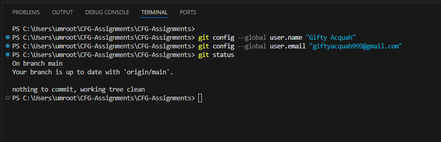
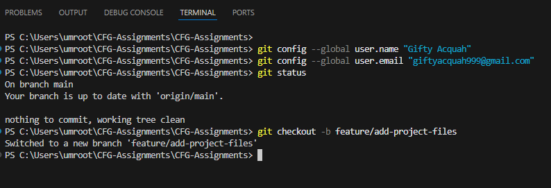
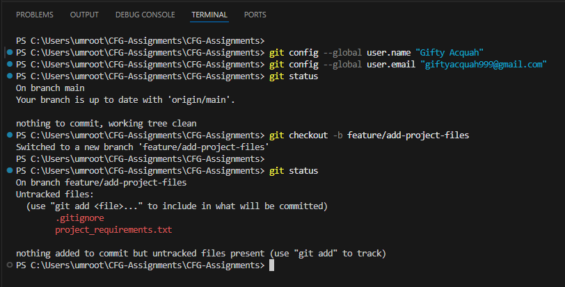
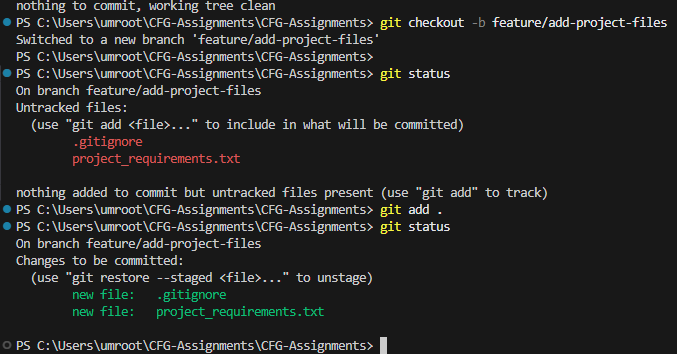
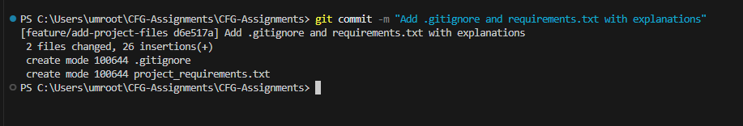
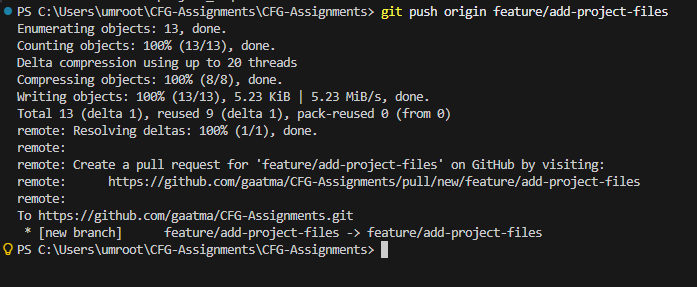
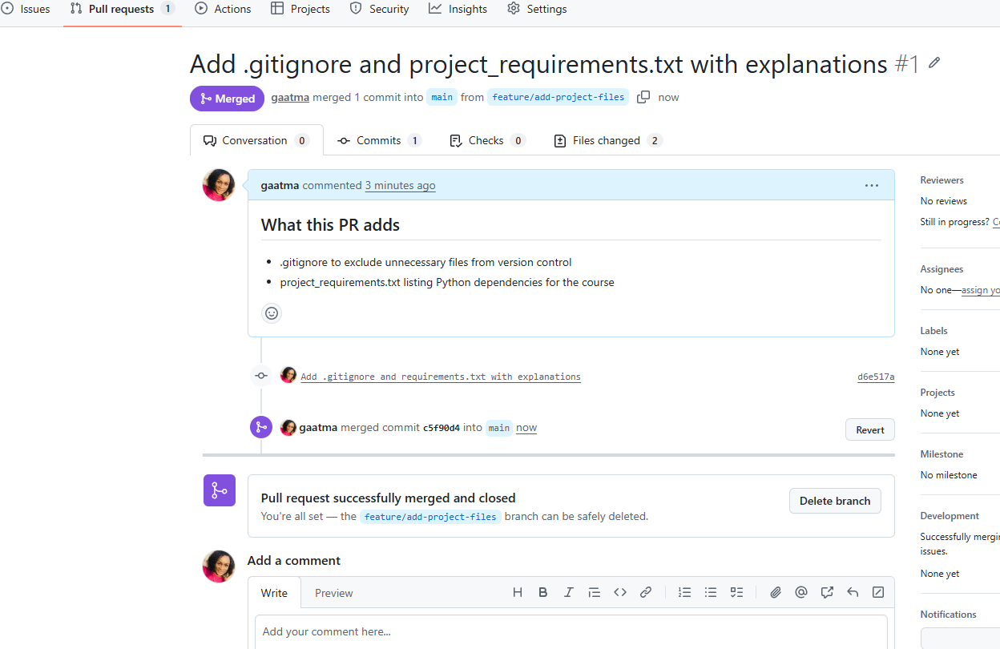
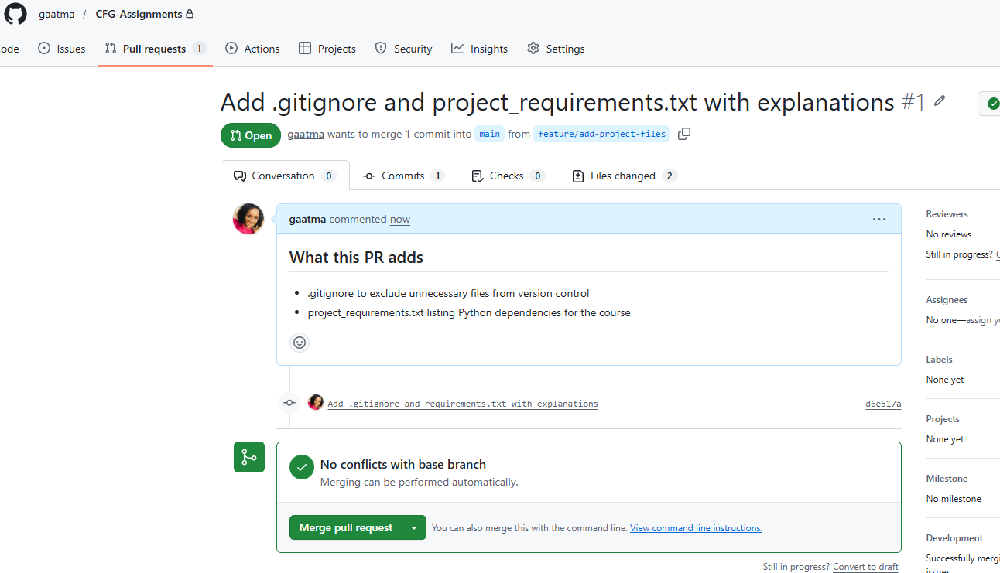

# Gifty Acquah — CFG Data Science & ML Assignments

## About Me

I'm **Gifty Acquah**, a PhD Candidate in Information Systems Engineering 
at **Concordia University**, researching cybersecurity and AI for critical 
infrastructure protection. I am also a Data Science & ML student with 
**Code First Girls (CFG)**.

---

## Previous Projects & Experience

| Project | Description | Tools Used |
|---|---|---|
| Smart Grid Intrusion Detection | ML-based anomaly detection for energy networks | Python, Scikit-learn |
| IOC Extraction Tool | Automated threat intelligence parsing | Python |
| Secure File Upload API | Access-controlled backend system | Java Spring Boot |
| Bone Fracture Detection | Automated medical image analysis | MATLAB |

---

## What I'll Use This Repository For

This repository — **CFG-Assignments** — will store all my work for the 
CFG Foundation Module, including:

- Git & GitHub assignment (Assignment 1)
- Data Science notebooks
- Machine Learning projects
- Notes and resources

---

## Git Commands I Used in This Assignment

### Checking status
```bash
git status
```

### Creating a branch
```bash
git checkout -b feature/add-project-files
```

### Adding files to a branch
```bash
git add .
```

### Adding commits with meaningful messages
```bash
git commit -m "Add .gitignore and project_requirements.txt with explanations"
```

### Opening a pull request
> Done via GitHub UI — see screenshots below ⬇️

### Merging to main branch
> Done via GitHub UI — see screenshots below ⬇️

---

## Screenshots

### 1. Checking git status — clean branch


### 2. Creating a new branch


### 3. git status — untracked files in red


### 4. git status — files added in green


### 5. git commit with meaningful message


### 6. git push branch to GitHub


### 7. Pull request opened on GitHub


### 8. Pull request merged


---

## About .gitignore

A `.gitignore` file tells Git which files and folders to **ignore** and 
**not track**. This is useful for:

- Keeping sensitive files (like API keys or passwords) out of GitHub
- Excluding large files that don't need version control
- Ignoring system files like `.DS_Store` on Mac

---

## About requirements.txt

A `project_requirements.txt` file lists all the **Python packages and dependencies** 
needed to run the project. This allows anyone who clones the repository to 
install everything they need by running:
```bash
pip install -r project_requirements.txt
```

---

## Community & Mentorship

Alongside my studies, I am the founder of:

- **Creative Brains** — mentoring 100+ students in coding and cybersecurity
- **Odontwe Hope Foundation** — giving hope, support, and opportunities to children facing extreme hardship by providing basic needs, 
mentorship, and access to education so they can rise beyond their circumstances and achieve their full potential

> *"If I made it, you can make it too."*

---
